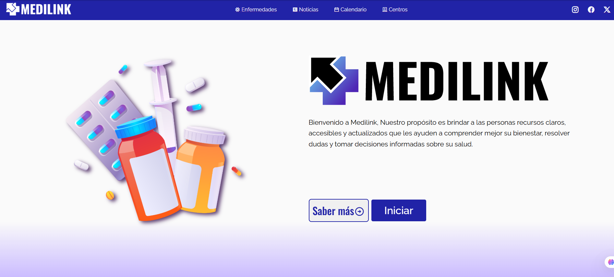

#Medilink
Medilink es una proyecto desarrollado para Hackaton Nicaragua 2025, consiste en una página web orientada a proveer información relevante sobre la salud en Nicaragua, con un enfoque inicial en la ciudad de Estelí, el objetivo del proyecto es brindar una plataforma de información confiable, personalizada y facil de usar. 

Con MediLink, buscamos acercar la tecnología a la salud, facilitando el acceso a información vital y contribuyendo al bienestar de la comunidad.

------------

##Caracteristicas
**-Sección de Homepage**

**-Seccion de información general de distintas enfermedades.**

**-Seccion de Noticias medicas**

**-Calendario funcional en donde se mostrarán eventos relacionados con el area médica**

**-Sección de busqueda de centros de salud cercanos.**

##Tecnologías

-HTML5
-CSS3
-Javascript
-Librerias de iconos Remixicon, Material Symbols & icons

##Licencia
Este proyecto está bajo la licencia MIT.
